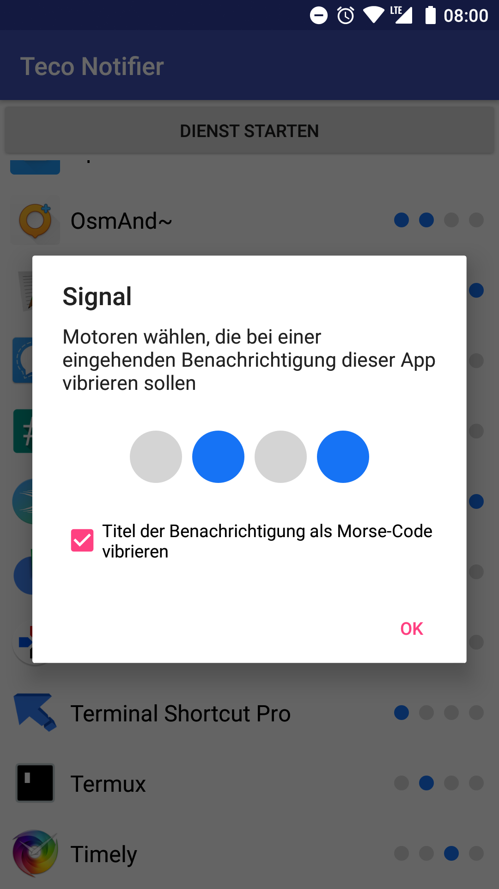

# TECO Nofifier

App, die sich über BLE mit dem TECO Wearable verbindet und dieses bei eingehenden Benachrichtigungen vibrieren lässt. Dabei kann pro App ein Vibrationspattern gewählt werden. Zusätzlich kann der Titel der Benachrichtigung (meist Name der Person) mit Morse-Code vibriert werden.

